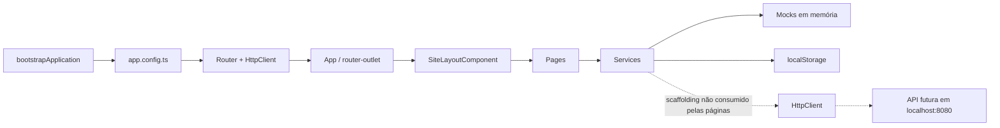
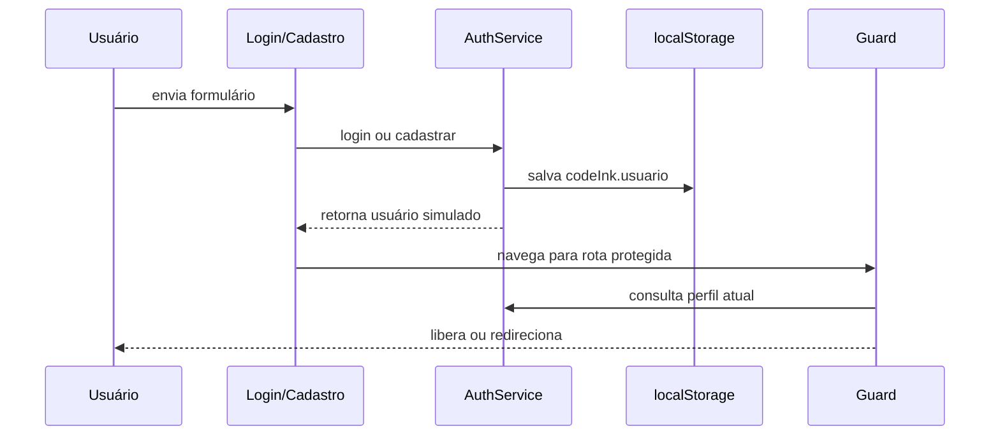
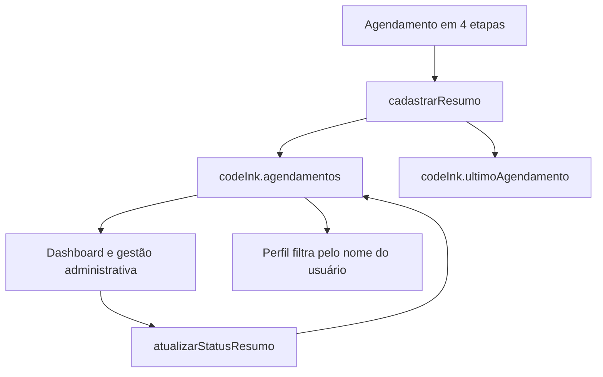
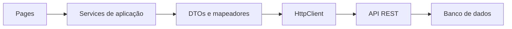

# Arquitetura do Code Ink

Atualizado em 27/07/2026 com base exclusivamente no código deste repositório.

## Escopo confirmado

O repositório contém um frontend Angular standalone. Não foram encontrados, nesta raiz, backend Spring Boot, banco de dados, migrations, contratos OpenAPI ou aplicativo Flutter.

A arquitetura operacional de hoje é uma aplicação cliente que combina:

- dados fixos de `catalogo.mock.ts`;
- estado reativo nos componentes e em `AuthService`;
- persistência no `localStorage` para sessão e agendamentos;
- services HTTP tipados ainda não usados pelas páginas.

## Visão geral



`provideHttpClient()` está registrado em `app.config.ts`, mas isso apenas disponibiliza o cliente HTTP. Não confirma a existência nem o funcionamento de uma API.

## Inicialização

1. `src/main.ts` chama `bootstrapApplication(App, appConfig)`.
2. `src/app/app.config.ts` registra listeners globais de erro do navegador, `HttpClient` e o router.
3. `App` renderiza o `router-outlet` principal.
4. Login e cadastro são exibidos fora do layout do site.
5. As demais páginas são filhas de `SiteLayoutComponent`, que inclui navbar, conteúdo e footer.

Todos os componentes são standalone e usam `ChangeDetectionStrategy.OnPush`. As páginas são carregadas sob demanda com `loadComponent`.

## Rotas

| Rota                      | Página                 | Acesso                  | Fonte principal de dados                 |
| ------------------------- | ---------------------- | ----------------------- | ---------------------------------------- |
| `/`                       | Home                   | público                 | `CatalogoService`                        |
| `/home`                   | redireciona para `/`   | público                 | —                                        |
| `/portfolio`              | Portfólio              | público                 | `CatalogoService`                        |
| `/portfolio/:id`          | Detalhe da tattoo      | público                 | `CatalogoService`                        |
| `/flash`                  | Flash tattoos          | público                 | `CatalogoService`                        |
| `/tatuadores`             | Tatuadores             | público                 | `CatalogoService`                        |
| `/tatuadores/:id`         | Perfil do tatuador     | público                 | `CatalogoService`                        |
| `/agendamento`            | Novo agendamento       | público                 | catálogo + `AgendamentoService`          |
| `/contato`                | Contato                | público                 | estado local do formulário               |
| `/login`                  | Login                  | público, fora do layout | `AuthService`                            |
| `/cadastro`               | Cadastro               | público, fora do layout | `AuthService`                            |
| `/perfil`                 | Perfil do cliente      | `clienteGuard`          | autenticação + agendamentos locais       |
| `/dashboard`              | Dashboard              | `adminGuard`            | agendamentos locais + indicadores mistos |
| `/dashboard/agendamentos` | Gestão de agendamentos | `adminGuard`            | `AgendamentoService`                     |
| `**`                      | Página 404             | público                 | —                                        |

`clienteGuard` aceita perfis `cliente` e `admin`. `adminGuard` aceita somente `admin`. Ambos preservam a URL solicitada no parâmetro `redirect` ao enviar o usuário para o login.

`authGuardGuard` e `tatuadorGuard` existem, mas não estão associados a rotas. Não existe área de tatuador implementada.

## Camadas e responsabilidades

### Pages e Components

Um Component é a unidade de interface do Angular. Neste projeto:

- `pages/` contém as telas ligadas às rotas;
- `shared/` contém elementos reutilizáveis: layout, navbar, footer, cabeçalho e cards;
- os componentes controlam interação e apresentação, delegando catálogo, sessão e agendamento aos services.

Os formulários de login, cadastro e contato usam Reactive Forms. Filtros e etapas de agendamento usam signals e `computed`.

### Services

Um Service centraliza estado ou acesso a dados para que os componentes não precisem conhecer todos os detalhes de armazenamento.

| Service              | Uso atual                                       | Estado                                              |
| -------------------- | ----------------------------------------------- | --------------------------------------------------- |
| `CatalogoService`    | artistas, trabalhos, flash tattoos e avaliações | ativo com mocks locais                              |
| `AuthService`        | login, cadastro, logout e sessão                | ativo, simulado no navegador                        |
| `AgendamentoService` | lista, criação local e alteração de status      | ativo localmente; também possui CRUD HTTP não usado |
| `UsuarioService`     | CRUD HTTP                                       | scaffolding, sem consumidor nas páginas             |
| `ClienteService`     | CRUD HTTP                                       | scaffolding, sem consumidor nas páginas             |
| `TatuadorService`    | CRUD HTTP                                       | scaffolding, sem consumidor nas páginas             |
| `TatuagemService`    | CRUD HTTP                                       | scaffolding, sem consumidor nas páginas             |
| `PortifolioService`  | CRUD HTTP                                       | scaffolding, sem consumidor nas páginas             |
| `PagamentoService`   | CRUD HTTP                                       | scaffolding, sem consumidor nas páginas             |
| `AdminService`       | nenhuma operação                                | vazio e sem consumidor                              |

`CatalogoService.listar()` lança `Method not implemented.` e não é chamado pelo código atual. Os métodos específicos (`listarArtistas`, `listarFlashTattoos` etc.) são os métodos em uso.

### Models

Um Model descreve a estrutura dos dados usada pelo TypeScript.

Há dois grupos:

1. Models de domínio preparados para uma API: `Usuario`, `Cliente`, `Tatuador`, `Agendamento`, `Tatuagem`, `Portfolio` e `Pagamento`.
2. Models de apresentação usados pelos mocks e telas: `ArtistaCatalogo`, `TrabalhoPortfolio`, `FlashTattoo`, `AgendamentoResumo`, `UltimoAgendamentoResumo` e `AvaliacaoArtista`.

Essa separação é útil, mas ainda não há mapeadores ou DTOs que convertam respostas de uma API para os formatos da interface. `Admin` é uma classe vazia e não é usada.

## Fluxos atuais

### Catálogo e páginas públicas

```text
Page
  -> injeta CatalogoService
  -> recebe arrays somente leitura de catalogo.mock.ts
  -> filtra ou seleciona dados no navegador
  -> renderiza cards e detalhes
```

Portfólio e flash tattoos aplicam filtros locais. Detalhes de tattoo e perfil de tatuador usam o parâmetro de rota; se o ID não existir, o código apresenta o primeiro item do mock em vez de abrir a página 404.

A maioria das imagens do catálogo aponta para o Unsplash. Sem internet, a estrutura da aplicação continua disponível, mas essas imagens podem não aparecer.

### Autenticação simulada



Regras confirmadas do login:

- senha aceita: `123456`;
- `admin@email.com` recebe perfil `admin`;
- qualquer outro email válido recebe perfil `cliente`;
- o checkbox “Lembrar de mim” não muda a persistência: a sessão sempre é salva no `localStorage`;
- cadastro cria uma sessão de cliente, mas não envia nem guarda telefone e senha no service.

Não há token, expiração, hash de senha ou validação de sessão por servidor. O interceptor de autenticação apenas encaminha a requisição e não está registrado.

### Agendamento local



O fluxo salva um resumo quando o usuário confirma data e horário. O nome vem da sessão atual; sem sessão, usa `Cliente`. A rota é pública e não há verificação de disponibilidade, integração com calendário, pagamento, upload ou envio ao estúdio.

`AgendamentoService` combina:

- quatro agendamentos iniciais de `catalogo.mock.ts`;
- registros criados ou sobrescritos em `codeInk.agendamentos`;
- migração da chave antiga `codeInk.ultimoAgendamento` quando a lista nova ainda não existe;
- métodos HTTP de CRUD que não são chamados pelas páginas atuais.

A gestão administrativa permite confirmar um agendamento pendente e cancelar um pendente ou confirmado. Cancelados e finalizados ficam bloqueados conforme as regras do template.

### Contato

O formulário valida nome, email, assunto e mensagem. Quando válido, apenas mostra uma confirmação e limpa os campos. Nenhum email ou HTTP é enviado.

### Favoritos e perfil

O botão de favorito no detalhe altera apenas um signal da página e perde o estado ao sair dela. A seção “Favoritos” do perfil sempre mostra os cinco primeiros trabalhos do mock; não existe ligação entre esses comportamentos.

Telefone, data de nascimento, quantidade de inspirações e avaliações exibidos no perfil são valores fixos do template.

### Dashboard

Totais de agendamentos e clientes são calculados a partir da lista local. Os indicadores de tatuagens (`18`) e avaliações (`35`, média `4,8`) são fixos. Os atalhos de portfólio, tatuadores e flash abrem páginas públicas e não implementam edição.

## Scaffolding de API

Os endpoints codificados são:

| Recurso      | URL                                  |
| ------------ | ------------------------------------ |
| Usuários     | `http://localhost:8080/usuarios`     |
| Clientes     | `http://localhost:8080/clientes`     |
| Tatuadores   | `http://localhost:8080/tatuadores`   |
| Tatuagens    | `http://localhost:8080/tatuagens`    |
| Portfólios   | `http://localhost:8080/portifolios`  |
| Pagamentos   | `http://localhost:8080/pagamentos`   |
| Agendamentos | `http://localhost:8080/agendamentos` |

Essas URLs estão repetidas diretamente nos services; não existe configuração por ambiente.

## Fluxo futuro de API

O desenho abaixo é uma direção sugerida, não uma funcionalidade existente:



TODO antes da integração:

- confirmar onde está o backend e quais endpoints realmente existem;
- publicar ou versionar o contrato da API;
- definir DTOs e conversão para os models de apresentação;
- configurar URLs por ambiente;
- decidir autenticação e implementar o interceptor somente depois disso;
- definir tratamento de loading, erro e indisponibilidade;
- confirmar CORS e persistência do banco;
- substituir mocks de forma incremental, com testes por fluxo.

## Testes e garantias atuais

Em 29/07/2026 foram executados com sucesso o build de produção, `ngc --noEmit` e os testes automatizados.

Existem cinco arquivos de teste, totalizando quatorze testes aprovados:

- criação do shell `App` e presença de `router-outlet`;
- criação de `NavbarComponent`;
- regras locais do `AgendamentoService`, incluindo listagem, cadastro, persistência, atualização de status, deduplicação, chave legada e JSON inválido.
- alternância da visibilidade da senha e atributos acessíveis no `LoginComponente`;
- alternância da visibilidade da senha e atributos acessíveis no `CadastroComponente`.

Ainda não há evidência automatizada de acessibilidade geral, responsividade, autenticação completa, validações de formulários, guards, filtros, integração entre rotas ou fluxos completos. Os controles de senha dos formulários já possuem cobertura específica. A persistência local de agendamentos também possui cobertura no `AgendamentoService`. A marcação possui elementos semânticos, atributos ARIA pontuais e media queries, mas conformidade WCAG/AXE não foi medida.
